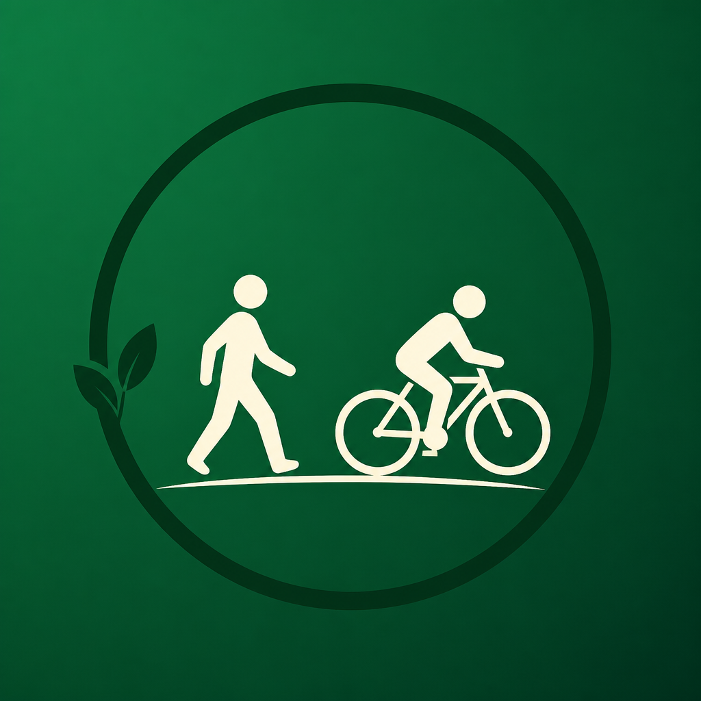

<p align="center">
  
</p>

<h1 align="center">Зелёный Маршрут</h1>

<p align="center">
  <strong>Приятный кусок пути — старт и финиш где удобно — дальше в привычном навигаторе.</strong>
</p>

<p align="center">
  Для тех, кто гуляет и катается <em>по случаю</em>, а не тренируется по плану.<br/>
  Без «спортивных» приложений. С Зелёным кольцом Москвы и треками Подмосковья.
</p>

<p align="center">
  <a href="#для-кого">Для кого</a> ·
  <a href="#как-это-работает">Как работает</a> ·
  <a href="#чем-мы-сильнее">Почему мы</a> ·
  <a href="#сравнение">Сравнение</a> ·
  <a href="#разработка">Разработка</a>
</p>

---

## Зачем мы вообще

Большинство городских прогулок и велопоездок ломаются не о рельеф, а о **решении «куда ехать»** и о том, что нормальные треки живут в приложениях «для своих», а в Яндексе — только точки А→Б по дорогам.

**Зелёный Маршрут** берёт уже продуманную линию (кольцо, лесопарк, набережная), даёт выбрать **свой** отрезок и отдаёт его так, чтобы человек не учил новый навигатор.

> Не «стань атлетом».  
> А «выйди на два часа и будет красиво».

Канон продукта: [`docs/PRODUCT.md`](docs/PRODUCT.md).

---

## Для кого

| 💚 Наш человек | 🌑 Не наш фокус |
|---------------|----------------|
| Гуляет / катается иногда, «по случаю» | Готовится к гонке, ведёт тренировочный дневник |
| Нет Komoot, Strava, «особого» hiking-стека | Живёт в треках, вейпоинтах и офлайн-картах |
| Привык к **Яндекс.Картам** | Хочет только «свой» GPX-редактор |
| Город и ближайшее Подмосковье | Многодневные походы и экспедиции |
| Хочет приятно провести время | Соцсеть километров и лайков |

**Коротко:** непрофессионалы, которым не нужны специальные приложения для прогулок — им нужен понятный маршрут «отсюда досюда» по уже красивой линии.

---

## Как это работает

```text
  Выбрать трек          Указать удобные          Получить кусок           Идти / ехать
  из карусели      →    старт и финиш       →    км · время · точки   →   в Яндексе
  (ЗКМ, МО…)            на линии                 на карте                  или в приложении
```

1. **Готовый трек** — Зелёное кольцо Москвы (~162 км) и подборка веломаршрутов Подмосковья.
2. **Старт и финиш по жизни** — ближайшая точка, флаг на карте, кусок на N км или на время.
3. **Привычный навигатор** — открываем маршрут в Яндекс.Картах кусками (учитываем лимит точек) или ведём лёгкой навигацией внутри приложения.
4. **Свои воспоминания** — профиль, история прогулок, ачивки — без обязательной почты.

Навигация строится **локально** по геометрии трека. API Яндекс.Карт на построение маршрута **не расходуется** — только deep link в привычное приложение.

---

## Чем мы сильнее

| Сила | Что это значит для человека |
|------|-----------------------------|
| **Старт/финиш где удобно** | Не нужно добираться «к началу GPX». Встал у дома у кольца — пошёл свой кусок. |
| **Привычный навигатор** | Не учим второй Maps. Отдали линию в Яндекс — как всегда. |
| **Готовые приятные линии** | Не пустая карта «нарисуй сам», а отобранные кольца и треки. |
| **Городской casual** | Язык и сценарий про выходной / вечер, не про ультрамарафон. |
| **Кусок, а не весь мир** | 8 км после работы важнее, чем «загрузить весь трек на 70 км». |
| **Без спортивного шума** | Нет обязательной соцсети, пульса и «сегментов для рекорда». |

---

## Сравнение

| | **Зелёный Маршрут** | Яндекс / 2ГИС сами | Komoot / Outdooractive | Strava |
|--|---------------------|--------------------|------------------------|--------|
| Сценарий | Приятный кусок готового трека | А→Б по дорогам / ПТ | Подготовка outdoor-маршрута | Тренировка и соцсеть |
| Для кого | Casual, без спец. приложений | Все | Активный outdoor | Атлеты |
| Старт «где стою» на красивой линии | ✅ ядро продукта | ❌ линия сама не «зелёная» | ⚠️ надо уметь | ⚠️ не про это |
| Привычный РФ-навигатор | ✅ Яндекс кусками | ✅ это и есть навигатор | ❌ свой UI / экспорт | ❌ |
| Готовые треки МО / ЗКМ | ✅ в карусели | ❌ | частично, другой фокус | ❌ |
| Обучение «новому спортивному миру» | не нужно | не нужно | часто нужно | часто нужно |
| Соцсеть / рейтинги | нет (и не цель) | нет | есть | ядро |

**Вывод:** мы не конкурируем с Strava «кто быстрее». Мы занимаем щель между «просто Яндекс по улицам» и «тяжёлые outdoor-приложения» — для людей, которым нужна **красивая готовая линия** и **привычный способ по ней ехать**.

---

## Что внутри сейчас

- Карусель маршрутов: ЗКМ + треки с [mosregdata](https://mosregdata.ru/article/files-cycling-routes-mo)
- Вело / пешком, направление, длина или время участка
- GPS → ближайшая точка на линии
- Навигация в приложении или в Яндекс.Картах
- Профиль, история прогулок, ачивки
- iOS (TestFlight) · Android (APK) · PWA-ядро на Capacitor

### На горизонте (идея)

Загрузка **своего GPX** (платно, позже): длинный файл → нарезка на десятки коротких кусков под лимиты навигатора → маршрут сохраняется у пользователя.  
**Пока оплату и paywall не вводим** — только продуктовый ориентир.

---

## Стек

| Слой | |
|------|--|
| Клиент | TypeScript, Vite, MapLibre, Capacitor (iOS / Android) |
| API | Node.js, Express, SQLite |
| Карты | локальная геометрия трека + deep link в Яндекс.Карты |

Репозиторий: публичный · API на Railway удобно цеплять из папки [`server/`](server/).

---

## Разработка

```bash
# API
cd server && npm i && npm start   # :8787

# Веб / клиент
export VITE_API_BASE="http://$(ipconfig getifaddr en0):8787"
npm i && npm run build
npx cap sync android   # или ios
```

Подробности сборки APK — ниже по желанию; продукт важнее скриптов.

<details>
<summary>Android debug APK</summary>

```bash
export ANDROID_HOME="$HOME/Library/Android/sdk"
cd android && ./gradlew assembleDebug
# → android/app/build/outputs/apk/debug/app-debug.apk
```

</details>

### Логин (если включён аккаунт)

- Логин: 3–32, латиница / цифры / `_`
- Пароль: 8–72, буква + цифра
- Антиспам по IP на регистрацию и вход

---

<p align="center">
  <strong>Зелёный Маршрут</strong><br/>
  <em>Не ещё один спортивный трекер.<br/>
  Просто приятно провести время — по красивой линии, начиная там, где вам удобно.</em>
</p>
